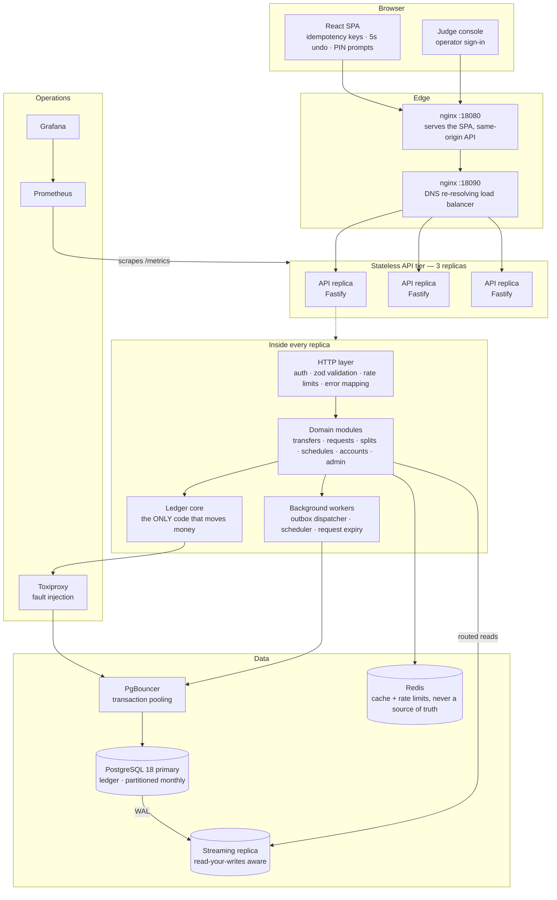
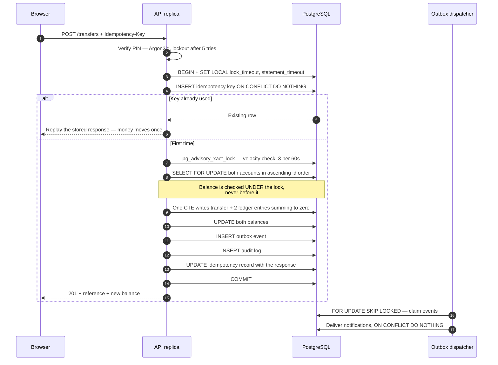

# TakaFlow — a money movement platform that always adds up

**PSTU IT Carnival 2026 — Hackathon Challenge: Money Movement Application**

A digital wallet where users send, request, split and schedule money. The brief asked for a system
"a growing community depends on, expecting every transaction to be correct, reliable and
trustworthy", at a scale of 10 million users. So this is built as a **double-entry ledger with an
API in front of it**, not as a CRUD app with a `balance` column.

The single sentence that explains most of the design decisions below:

> **A balance is not a number we store. It is the sum of a ledger we can prove.**

---

## Table of contents

- [Run it in two minutes](#run-it-in-two-minutes)
- [Judge console — every feature in one click](#judge-console--every-feature-in-one-click)
- [System architecture](#system-architecture)
- [The anatomy of one payment](#the-anatomy-of-one-payment)
- [What is built](#what-is-built)
- [Strong points](#strong-points)
- [Problems solved](#problems-solved-and-what-they-cost-to-find)
- [Correctness guarantees](#correctness-guarantees)
- [Testing](#testing)
- [Measured results](#measured-results)
- [API surface](#api-surface)
- [Repository layout](#repository-layout)
- [What is deliberately not claimed](#what-is-deliberately-not-claimed)

---

## Run it in two minutes

Requires Docker Desktop. Nothing else — no Node, no Postgres on the host.

```bash
cd takaflow
docker compose --profile scale up -d --build
```

| What | Where |
| --- | --- |
| **The app** | http://127.0.0.1:18080 |
| **Judge console** | http://127.0.0.1:18080/judge |
| API through the load balancer | http://127.0.0.1:18090 |
| Postgres | `127.0.0.1:5433` |
| Grafana *(needs `--profile obs`)* | http://127.0.0.1:3001 · `admin` / `takaflow` |
| Prometheus *(needs `--profile obs`)* | http://127.0.0.1:9090 |

The `scale` profile brings up **three API replicas behind nginx**, PgBouncer, a streaming Postgres
replica, and Toxiproxy — the same topology the concurrency and chaos results below were measured
on. Register any Bangladeshi-format number, e.g. `01712345678`, and the account is funded with
BDT 100,000 by a real minted double entry from the platform treasury.

> Every host address is written as `127.0.0.1` and never `localhost`. On Windows that is not
> cosmetic — see [problem #6](#6-ipv6-loopback-stalled-the-postgres-handshake-not-the-tcp-connect).

---

## Judge console — every feature in one click

**http://127.0.0.1:18080/judge** · username `judge` · password `takaflow-demo-2026`

Eleven buttons. Each one creates its own users on the spot, drives the **real API over HTTP**, and
prints what the server actually answered — status codes, balances, references — with PASS/FAIL per
step. Nothing is mocked and nothing is pre-seeded, so a green result is evidence rather than a
caption. There is a **Run everything** button; the full sweep takes about fifteen seconds.

| # | Scenario | The question it answers |
| --- | --- | --- |
| 1 | Money moves as double entry | Does a payment debit one account and credit another, with the books still balanced? |
| 2 | A double-tap pays once | Two identical requests, one idempotency key — does the money move twice? |
| 3 | Ten simultaneous payments | Ten at once from an account that can only afford two — what happens? |
| 4 | Scripted bursts are throttled | Ten rapid transfers — how many get through? |
| 5 | Unusual transfers raise an alert | Is a very large payment blocked, or allowed and reported? |
| 6 | Emergency freeze | Can a user stop all outgoing money in one tap — and can a thief undo it? |
| 7 | Requesting money | Does accepting settle the state **and** the money at once? |
| 8 | Splitting a bill exactly | BDT 100 between three people — where does the missing poisha go? |
| 9 | Scheduled payment | Does it pay once, even when the scheduler runs twice? |
| 10 | Reversal without editing history | Undoing a payment — is the original record changed? |
| 11 | The books balance | After all of the above, do the four ledger invariants still hold? |

The console signs in with credentials that are **exchanged** for the operator token, so a shared
secret is never typed into a browser, and the token lives in that tab's session storage only.

---

## System architecture



**Why this shape.** A modular monolith with a hard internal seam, deployed as identical stateless
replicas. Money movement is one transaction against one database, because a distributed
transaction across services would buy scaling we do not need at the cost of the correctness we
cannot lose. Everything that is *not* money movement — notifications, scheduling, expiry — is
already event-driven through a transactional outbox, so those seams can become services later
without touching the ledger.

The pieces that make it scale are in place rather than promised: monthly range partitioning,
keyset pagination everywhere, a read replica with per-user read-your-writes routing, connection
pooling through PgBouncer, and a striped treasury so 10 million signups do not serialise behind one
row.

---

## The anatomy of one payment



Every one of those writes is in **one transaction**. There is no instant at which the money has
moved but the ledger, the audit log or the notification intent has not.

---

## What is built

| Area | Features |
| --- | --- |
| **Money** | Send money · request money · accept/decline/cancel · reversal within a 60s window · transaction history with filters · receipts · streaming CSV statement |
| **Group money** | Split a bill evenly or by weight, with exact poisha allocation; each leg is an ordinary money request |
| **Automation** | Scheduled and recurring transfers — once, daily, weekly, monthly — with retry, catch-up suppression and per-occurrence history |
| **Safety** | PIN on every movement · 5-second undo before sending · emergency self-freeze · velocity limiting · security alerts on unusual amounts · daily and per-transfer caps |
| **Operations** | Reconciliation endpoint · audit search · account freeze/unfreeze · runtime-tunable fraud policy · worker triggers · Prometheus metrics · Grafana dashboard · alert rules |
| **Platform** | Idempotency on every mutation · transactional outbox · read replica routing · connection pooling · monthly partitioning · keyset pagination · graceful shutdown |

---

## Strong points

**1. The ledger is the source of truth, and it is checkable.**
Four invariants are verifiable at any moment against the database — not against application state —
through `GET /api/v1/admin/reconciliation`. It returns HTTP 500 when it fails, so a monitor that
only reads status codes still notices.

**2. Idempotency where it actually protects you.**
The key is claimed and completed **inside the same transaction as the money**. There is no third
state where a crash leaves a key claimed but the payment unresolved: after a crash the key either
exists with its response, or does not exist at all. The stored response is byte-identical on
replay, which is why the column is `json` and not `jsonb` — `jsonb` reorders keys.

**3. Concurrency is handled by the database, not by hope.**
Two accounts are locked with `SELECT … FOR UPDATE` in **ascending id order**, so A→B and B→A
cannot deadlock. Balances, daily limits and velocity are all evaluated *under* that lock. Every
state transition is a guarded statement whose `WHERE` clause carries its precondition, so an
accept racing a cancel is resolved by the database rather than by a read-then-write window.

**4. Time is bounded by something that can actually see it.**
Postgres cannot measure time spent on the wire, so `statement_timeout` alone lets a transaction
hold row locks for as long as the network is slow. There is an application-enforced transaction
deadline, checked before every statement, with the clock starting *after* a pooled connection is in
hand.

**5. Money is integers, end to end.**
`BIGINT` poisha in the database, `BigInt` in TypeScript, string over the wire, integer arithmetic
in the browser. The `pg` driver is configured so `int8` and `numeric` never become JS floats. A
BDT 100 bill split three ways produces 33.34 + 33.33 + 33.33 — the leftover poisha is handed out
by largest remainder, never dropped.

**6. Failure was tested by causing it.**
Seven chaos scenarios with Toxiproxy and `docker kill`, including killing the database mid-burst.
The system fails closed and stays correct: after every fault, reconciliation passes.

**7. It is honest.**
The load report states plainly that the p95 SLO is **not met** on the hardware it was measured on,
rather than relaxing the threshold. Six real bugs found during this build are written up in full,
including the two that were entirely our own fault.

---

## Problems solved, and what they cost to find

Documented at length in [`takaflow/docs/chaos-results.md`](takaflow/docs/chaos-results.md).

#### 1. A transaction can hold locks far longer than any configured timeout
Under injected latency, server-side timeouts stayed happily under their limits while a transfer
held its row locks for tens of seconds. Fixed with an application-enforced transaction deadline.

#### 2. The microsecond bug — three times, in three disguises
Postgres `timestamptz` is microsecond-precision; a JS `Date` is millisecond. Round-tripping a
timestamp through JS **truncated** it, and that single mismatch caused: all transaction history to
come back empty, a reversal's guarded `UPDATE` to match zero rows, and pagination cursors to
silently *skip* rows written in the same millisecond. Fixed with a branded `PgTimestamp` type that
keeps the server's full-precision text and refuses to produce an `Invalid Date` quietly.

#### 3. A repository was taking a second connection inside a transaction
A helper used the pool while its caller held a transaction. Under load the pool deadlocked against
itself — diagnosed with `pg_blocking_pids` showing `idle in transaction` sessions holding row
locks. Fixed by an `Executor` abstraction that makes it impossible to acquire a second connection
inside a transaction without saying so.

#### 4. Graceful shutdown was not graceful
SIGTERM hung on nginx keep-alive connections. Fixed with `forceCloseConnections: 'idle'`; 30 of 30
in-flight transfers now commit while a node drains.

#### 5. The load balancer was the outage
nginx caches upstream DNS at config load, so recreated API containers produced 502s while the API
was perfectly healthy. Fixed with a `resolver` directive and a variable in `proxy_pass`.

#### 6. IPv6 loopback stalled the Postgres handshake, not the TCP connect
Two tests failed intermittently with connection timeouts while the database sat idle with three
connections and `max_connections` at 300. Measured directly, 20 simultaneous connections per host:

| host | rounds | failures |
| --- | --- | --- |
| `127.0.0.1` | 3 × 20 | **0** |
| `::1` | 3 × 20 | 13, 3, 0 |
| `localhost` | 3 × 20 | 16, 0, 0 |

Raw TCP to `[::1]:5433` always connected in single-digit milliseconds — it was the Postgres
*startup and authentication exchange* stalling behind Docker Desktop's IPv6 loopback forwarder.
Since `localhost` resolves to `::1` first on Windows, the failure rate was a coin flip per run.
Fixing it also cut the test suite from 174s to 100s: passing tests had been quietly paying five
seconds for stalled handshakes.

#### 7. A hot account serialises everything behind one row
Every signup mints from the treasury, so one treasury row is a global lock. Striped across 8
accounts: **121 → 581 mints/s, a 4.8× improvement**, with the treasury's true balance being the
sum of the stripes.

---

## Correctness guarantees

**The four invariants** (checked by `/admin/reconciliation` and by the test suite):

1. Every transfer has exactly one debit and one credit, and they sum to zero.
2. Every account balance equals the sum of its ledger entries.
3. No user account is ever negative; only system accounts may be.
4. The platform as a whole nets to zero — money is never created or destroyed.

**Under concurrency**, proven by tests: 500 simultaneous transfers from an account that can afford
10 produce **exactly 10** successes and an exact final balance; 100 interleaved A→B and B→A
transfers produce zero escaping deadlocks; a request accepted by two devices settles once.

**Under failure**: a severed connection mid-payment leaves the sender's balance at one of exactly
two legal values — the payment happened, or it did not — and a retry with the original key resolves
it definitively.

**History is never edited.** A reversal is a new, opposite double entry. The original rows are
byte-for-byte unchanged, and the audit log has a trigger that denies `UPDATE` and `DELETE`
outright.

---

## Testing

| Suite | What it covers | Count |
| --- | --- | --- |
| Backend (Vitest, real Postgres) | unit · integration · concurrency · invariants · chaos | **237 tests / 20 files** |
| Browser (Playwright, real API) | the journeys a judge clicks through | **12 tests** |
| Live smoke (`scripts/smoke.mjs`) | the stack through nginx and 3 replicas | 16 checks |

Last full run: **237 passed / 237, in 173s** against a real PostgreSQL 18.

```bash
cd takaflow/backend  && npm test          # backend suite
cd takaflow/frontend && npm run e2e       # browser E2E
node takaflow/backend/scripts/smoke.mjs   # live stack
```

The concurrency suite deliberately drives 200–500 simultaneous transactions. The invariant suite
checks that the reconciliation checker **actually catches** a broken system — it plants money
created from nothing, a drifted balance and a half-written double entry, and fails if the checker
reports PASS.

---

## Measured results

Full write-ups: [`docs/load-results.md`](takaflow/docs/load-results.md) ·
[`docs/chaos-results.md`](takaflow/docs/chaos-results.md)

| Measurement | Result |
| --- | --- |
| 500 concurrent transfers, balance covers 10 | exactly **10** succeed, balances exact |
| Sustained load, 3 replicas | 38.1 transfers/s · p50 419 ms · **0 failed requests** |
| p95 latency | 829 ms — **the 500 ms SLO is not met** on 4 shared vCPUs, reported as-is |
| Requests shed, 3 replicas vs 1 | **0** vs 16 |
| Transport resets retried with original keys | 118, all resolved safely |
| Treasury striping | 121 → **581 mints/s** (4.8×) |
| Chaos scenarios | 7 injected faults, reconciliation **PASS** after every one |
| Property tests | 1,200 randomised operations across 3 seeds, invariants hold |

---

## API surface

All routes are under `/api/v1`. Mutations require an `Idempotency-Key`; money movements require the
user's PIN.

| Area | Endpoints |
| --- | --- |
| Auth | `POST /auth/register` · `/auth/login` · `/auth/refresh` · `/auth/logout` · `GET /me` |
| Accounts | `GET /accounts/me` · `GET /users/search` · `PATCH /accounts/me/freeze` |
| Transfers | `POST /transfers` · `GET /transfers` · `GET /transfers/:reference` · `POST /transfers/:reference/reverse` · `GET /transfers/statement.csv` |
| Requests | `POST /requests` · `GET /requests` · `POST /requests/:id/accept` · `/decline` · `/cancel` |
| Splits | `POST /splits` · `GET /splits` · `GET /splits/:id` |
| Schedules | `POST /schedules` · `GET /schedules` · `GET /schedules/:id` · `POST /schedules/:id/pause` · `/resume` · `DELETE /schedules/:id` |
| Notifications | `GET /notifications` · `POST /notifications/:id/read` |
| Operator | `POST /admin/login` · `GET /admin/reconciliation` · `/admin/outbox` · `/admin/audit` · `GET|PATCH /admin/policy/velocity` · `POST /admin/accounts/:id/freeze` · `/unfreeze` · `/admin/workers/run` · `/admin/schedules/:id/due` |

Operator endpoints are guarded by a token compared in constant time, and they **fail closed**: with
no token configured they refuse every request rather than falling open.

---

## Repository layout

```
takaflow/
├── backend/
│   ├── migrations/          10 forward-only SQL migrations, checksum-verified on boot
│   ├── src/
│   │   ├── platform/        db · idempotency · outbox · errors · auth · metrics · http
│   │   ├── modules/         transfers · requests · splits · schedules · accounts · admin · auth
│   │   ├── workers/         outbox dispatcher · scheduler · request expiry
│   │   └── shared/          money · timestamps · cursors · allocation
│   ├── tests/               unit · integration · concurrency · invariant · chaos
│   └── scripts/             gate · chaos · smoke · bench · read-your-writes drill
├── frontend/                React SPA, one hand-written stylesheet, Playwright E2E
├── ops/                     nginx · pgbouncer · replica bootstrap · prometheus · grafana · toxiproxy
├── docs/                    chaos-results.md · load-results.md
└── docker-compose.yml       profiles: default · scale · obs · load
```

Planning documents live at the repository root: [`prd.md`](prd.md) (including the verbatim brief
and the full edge-case matrix) and [`plan.md`](plan.md).

---

## What is deliberately not claimed

- **No automated failover.** The replica is promoted by hand; Patroni-class HA is out of scope.
- **Availability is not the promise.** When the database is down the API returns 503. It is
  designed to fail closed and stay correct, not to stay up.
- **The security alert email is a demo.** No mail provider is wired up: "sending" is a log line
  reading `SECURITY ALERT EMAIL SENT`. The parts that matter architecturally are real — it runs
  after commit, it cannot fail the payment, and the durable half is an outbox event written inside
  the money transaction.
- **The runtime fraud policy is per-instance.** It is held in memory, so tuning it hits one replica.
  The enforcement is not weakened by this — counting happens in the database under a lock — but a
  production system would keep the policy in a table.
- **Sharding is designed for, not deployed.** Accounts carry a `shard_key`; the cross-shard
  reservation saga is documented rather than built.
- **The p95 SLO is not met** on the hardware this was measured on, and that is reported rather than
  hidden.
